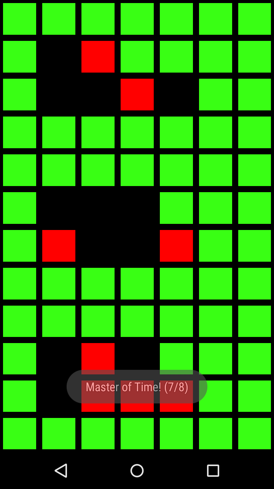

<h1>PixelRippler</h1>

PixelRippler is a sandbox/puzzle game for the Android platform.

 
<ul>
It's features include:
<li>Rippling sandbox</li>
<li>Multiple color palettes /li>
<li>Easter egg animations including a binary clock</li>
<li>Hidden 2 player strategy game</li>
</ul>

<h2>Screenshots</h2>

