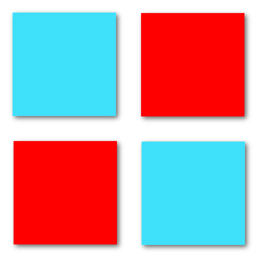
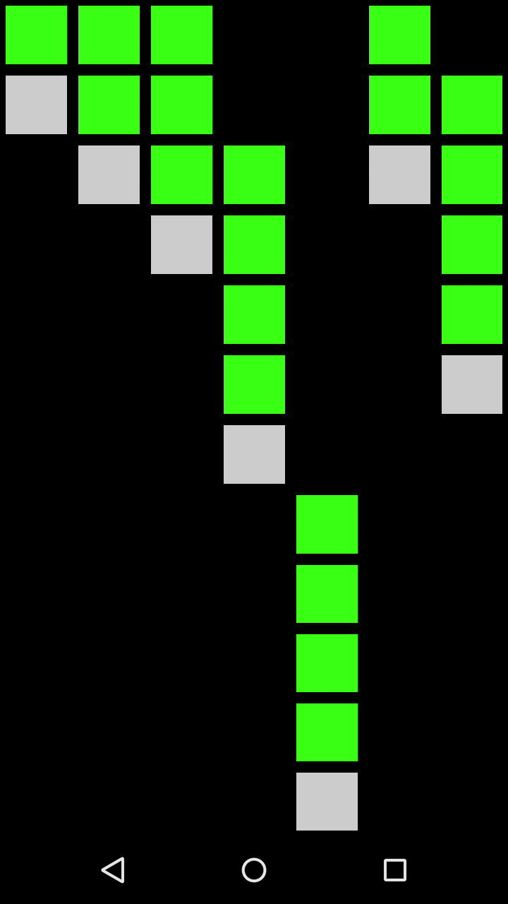
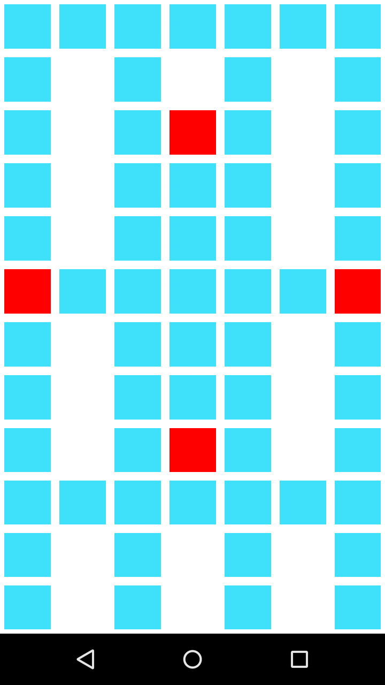

# PixelRippler

<h2>Overview</h2>
PixelRippler is a sandbox/puzzle game for the Android platform. The goal is to discover all 7 features or just make fun colors. 
 
<h2>Includes:</h2>
<ul>
<li>Rippling colors</li>
<li>Discoverable skins</li>
<li>Easter eggs including a binary clock</li>
<li>2 player strategy game</li>
<li>Fun (guaranteed or your money back)</li>
</ul>

<h2>Screenshots</h2>

